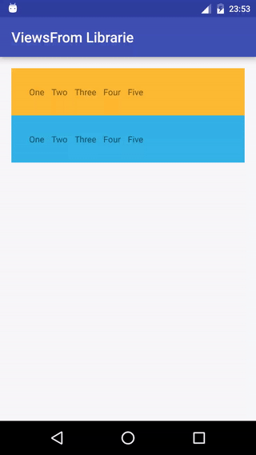

Android ViewsFrom
========
[](https://jitpack.io/#Jaouan/ViewsFrom) [](https://android-arsenal.com/details/1/4040) [](https://android-arsenal.com/api?level=14)

ViewsFrom is an android librarie that allows you to easily find and animate child views from one or multiple ViewGroups using their tag, type, visibility and much more.
This librairie is Android 14+ compatible.



Installation
--------
Gradle

```java
repositories {
  	maven { url "https://jitpack.io" }
}
```

```java
compile 'com.github.jaouan:viewsfrom:0.0.1'
```

Usage
--------
Use **Views** class as entry point, and let the librarie guides you.

First example : Animate all visible views from rootView.
```java
Views.from(rootView)
     .withVisibility(View.VISIBLE)
     .animateWith(context, R.anim.my_awesome_animation)
     .start();
```

Second example : Show all EditText with tags "example" from two group views.
```java
Views.from(myFirstLinearLayout, mySecondLinearLayout)
     .withType(EditText.class)
     .withTag("example")
     .forEach((view, index, count) -> {
       view.setVisibility(View.VISIBLE);
     });
```

A bit more complete example that shows what you can do :
```java
// Defines root views of your views finder.
Views.from(groupView1 /*, groupView2, ...*/)

     // Basics filters.
     .withTag("abc" /*, "efg", ...*/)
     .withTagRegex("[a-z]*" /*, "anotherRegex", ...*/)
     .withId(R.id.my_wonderful_id,  /*, R.id.my_another_id, ...*/)
     .withType(TextView.class /*, EditText.class, ...*/)
     .withVisibility(View.GONE /*, View.INVISIBLE, ...*/)

      // Negate "with*" filters by prefixing with "not" method.
      not().withId(R.id.one_more_id /*, R.id.gimme_more_id*/)

      // Custom filter.
     .filteredWith((view) -> {
       return /* your own filter */;
     })

     // Exclude views.
     .excludeView(myView1 /*, myViews2, ... */)

     // Options.
     .includingFromViews()
     .excludingChildsFromFilteredGroupViews()

     // Concate with a new views finder, with its own filters and options.
     .andFrom(group2)
     .withTag("xyz")
     
     // Order views.
     .orderedBy((view1, view2) -> {
       return /* your own comparator */;
     }

     // And animate them all !
     .animateWith(context, R.anim.my_awesome_animation)
     .withDelayBetweenEachChild(250)
     .withViewsVisibilityBeforeAnimation(View.INVISIBLE)
     .withEndAction(() -> {
       Log.i("ViewsFromLibExample", "It's finally over.");
     })
     .start();
```


You have 3 end points : **Find**, **iterate** and **animate**.

###### Find
Returns a views list.
```java
Views.from(groupView)
     .find();
```


###### Iterate
Iterates all views.
```java
Views.from(groupView)
     .forEach((view, index, count) -> {});
```

###### Animate
```java
Views.from(groupView)
     .animateWith(() -> {
       return /* your animation instance */;
     })
     // or
     // .animateWith(context, R.anim.my_awesome_animation)
     .withDelayBetweenEachChild(250)
     .withViewsVisibilityBeforeAnimation(View.INVISIBLE)
     .withEndAction(() -> {})
     .start();
```

Views animator
--------
If you know which views has to be animated, you can still use **ViewsAnimator** as below :
```java
new ViewsAnimator(context, viewsIWantToAnimate, R.anim.my_smooth_animation)
     .withDelayBetweenEachChild(250)
     .withViewsVisibilityBeforeAnimation(View.INVISIBLE)
     .withEndAction(() -> {})
     .start();
```

ViewsAnimator's **start()** method can be called multiple times if you want.
```java
// First call.
ViewsAnimator viewsAnimator = Views.from(groupView)
     .animateWith(context, R.anim.my_awesome_animation)
     .start();

// Second call.
myButton.setOnClickListener((view) -> {
  viewsAnimator.start();
});
```

Note
--------
Be aware that when an end point is called, every child views are iterated in order to find which satisfies filters.
If your layout is very complex, prefer using multiple little group views instead of one big root view.


License
========

[Apache License Version 2.0](LICENSE)
